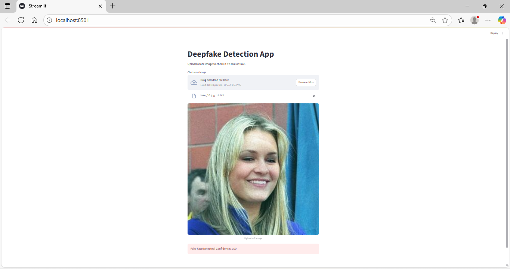

# Deepfake Image Classification using EfficientNet
This web app detects whether a face image is real or fake using a CNN-based EfficientNet model.
Tech Stack
- Frontend/UI: Streamlit
- Backend: Python
- Model: TensorFlow + Keras (EfficientNet)
- Image Handling: Pillow, NumPy
### Demo

